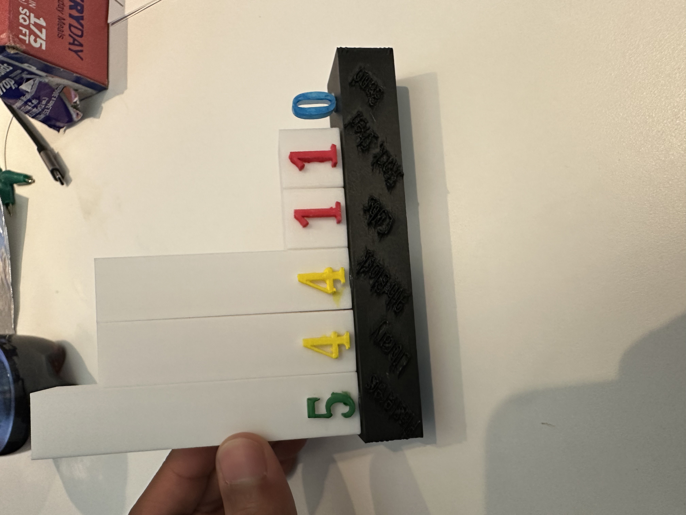

# EC Reflection #

  

During our group’s visits to the Education Commons (EC), we had a chance to work with various tools (3D printer, NFC tag reader, makey makey) to present data in The Umpire interactively. The main goal of the project was to present the dataset with tangible objects that the users can touch and see the data. Our group aimed to utilize multiple tools so that the datasets are available in various formats so that lack of access to certain technology (phones or computers) does not prohibit the users from interacting with the data. Most importantly, we aimed for the users to “actively” interact with the data rather than “passively” looking at the data. 

The design process began with the learning of various tools and how to utilize them. Tex, the program coordinator at the Education Commons, first introduced to us makey makey and it works by completing an electric circuit and any conducting materials can be used to complete the circuit. Then, he introduced us to NFC tags by giving us NFC tags that we can scan and link to any digital information that we want to store. Lastly, we learned about tinkercard and how to create a 3D design that can be printed using the 3D printer. For brainstorming topics, we discussed our blog posts and topics that we focused on. Since I have researched the impact of baseball on the inmates of the Eastern State Penitentiary and the primary focus of The Umpire was to report the baseball league, we decided to visualize the team standings in the ESP baseball league. We designed a 3D design of a bar graph of the win percentage of the teams. Since the bar graph would be constrained to one day of the league, Nick proposed to store records of the rest of the season in a digital format and connect it to the 3D bar graph with the NFC tag. To add a participation component to our project, we decided to utilize makey makey and use it as a joystick to play online baseball games. After design planning, the group was split into 3 teams to work on each of the interactive technologies. The 3D graph team worked on designing the bar graph in appropriate dimensions on tinkercard as well as assembling different parts of 3D printed materials and painting them. The NFC tag team worked on organizing the data in the Excel file, creating several digital graphs, and linking the file to the NFC tag. The makey-makey group worked on finding online games that can simulate the data as well as finding ways to make the makey-makey user-friendly.

In terms of implementing the goals, I think we have successfully presented the data that are visually clear as well as easily accessible. With the 3D printed bar graph and NFC tag attached, the users can visualize the graph in front of them as well as on the digital screen that can be accessed simply by putting their phone close to the bar graph. This meant that even if the user did not have a phone with them, the users could still view part of the data through the 3D representation of the team standings, which fulfilled our goal of making the data easily accessible. Also, through the interactive game of makey makey, we hoped that users could put themselves in the shoes of the prisoners and simulate the games played in the ESP baseball league through online platforms and technology. The active participation allowed the users to feel the dataset with multiple senses and remember the dataset by linking it to personal experience. The key success of our project was the implementation of three technologies to present one dataset in multiple perspectives. The user can choose the ways they want to interact with the data and the combination of multiple perspectives provides deeper insights, allowing a more comprehensive understanding of the information. As mentioned above, the interactive component through the online games also shifts the “passive” observation into the “active” participation. However, there are some limitations to the project that I would like to fix. First, the data stored in the NFC tag was not ideal for the users who wanted to study the changes in league standing over time. Since the league standings on different days were put onto different tabs of Excel files, the user had to manually click through each tab and track the performance of one team. To represent the season progression, the summary line graph tracking changes in the standings weekly could have been added to make the data visually clear. Another improvement with the project is with makey makey. I have gotten comments from colleagues about the difference between clicking the aluminum foil with the cable compared to clicking on the mouse. To differentiate the activity, we could use a conductive material to shape the makey makey into a video game console. Also, to simulate the cooperativity in team sports, the game could be made into a team game where one player controls the position of the bat while the other player controls the timing of the swing.

In the group, I took the role of Digital Asset Manager and took charge of organizing the research data and photos in one Google Drive. I created a Google Drive and shared it with all group members and ensured that all the images and documents went to the appropriate folder in the drive. Most importantly, I helped our fabricator, Tim, in learning how to use makey makey and turning it into an interactive game. I led the Makey Makey team to find the appropriate online game that anyone can learn and learned the ways different cables interact to completely make the console work. Besides my assigned role, since I had made my blog post about baseball in ESP, I helped Imani with creating a background slide, summarizing the article “Baseball Behind Bars: Prison Baseball at Eastern State Penitentiary in the Early Twentieth Century”. Overall, my group has worked very well together, collaborating in many aspects of the project and providing different ideas for the project. Everyone was there for the group meetings and fulfilled their assigned roles. Most importantly, everyone was willing to pitch in help for tasks that were beyond their roles. Since I was satisfied with how our group worked, there is not much to change about the group work environment. However, I thought that assigning roles often limited what group members could do. As mentioned above, my group ended up with group members working on various parts of the projects beyond their roles. Yet, we questioned whether we could work on certain tasks due to the roles that we were assigned. It could have been more efficient if we had a group leader and a secretary for leading group meetings but other group members could have received more freedom in the roles.
 
Overall, my group has collaboratively worked together to design a project that used multiple tools to project the dataset in The Umpire. My group was successful in combining a 3D printed material with the NFC tag digital dataset as well as adding an interactive component to the presentation with makey makey.
