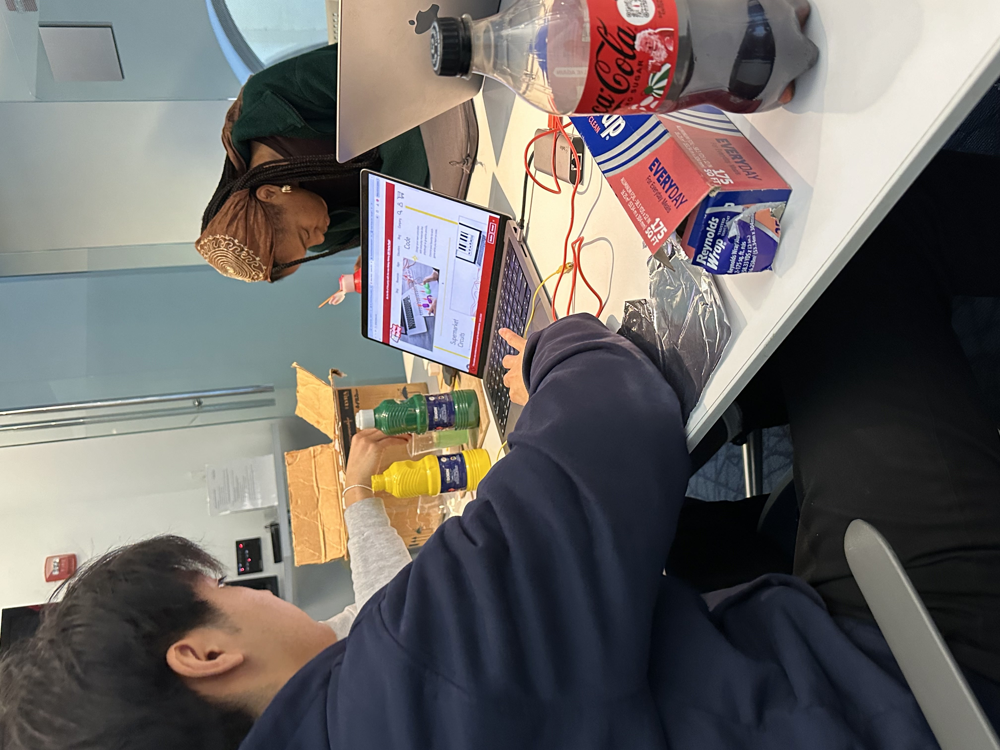

# Youbin's Reflection
## Welcome!

Welcome to my webpage, where I reflect on my work in COML 1650 for Fall 2024 semester. The mainpage includes the final reflection on the course. You can find links to all my work in the Portfolio page. I hope you enjoy!

## Main Reflection
When I first enrolled in the class and looked at the title of the course, I expected this class to center around Artificial Intelligence and how the digital world has an impact on humanities. Also, as listed in the course detail, I expected to learn more about computer science and coding algorithms for data organization. However, after successfully completing the course, my thoughts on digital humanities have changed completely and I was able to learn the importance of digital data.

If I have to summarize the main theme of the course in one phrase, I would have to summarize it as “digitization for better storage versus maintaining stories in the data”. Digital humanists constantly find ways to store old data found in books, newspapers, and other historical documents in digital formats for better storage and easy access for the public. The ways in which the digital humanists store data were learned through the visit to SCETI (Schoenberg Center for Electronic Text and Image) where I was able to physically observe how books are photographed and scanned with the camera and stored in the film that can be transferred to digital formats. It was a memorable experience to view the microfilms that store the picture of the book as well as all the machineries that are utilized. The class video (A (re)Introduction to Book Digitization at the Internet Archive) that had to be watched before the visit provided supplementary information on processes of book digitization: digitization, metadata, processing, preservation, and logistics. I was also able to compare and contrast the ways in which books are digitized at Penn versus Internet Archive. The digitization of the data provided great advantages for the users. During the DH project, I had a chance to explore the Penn archive and explore photographs of Penn campus in the 20th century. I realized how valuable the digital archives were in terms of storage and accessibility as I was able to access all those valuable photos just by clicking on the hyperlink. However, “there are stories in the data” (Bouk 3) and the digitization of data often undermines historical, cultural, and social stories behind the data. As the digital humanists digitize and organize the data for their needs, the “cleaning” process “wipes away what is different.” (Rawon and Munoz 280) Since the data are created within specific historical and cultural contexts, the diversity in the data must be valued and preserved. Rawon and Munoz argue that “rather than normalizing them, we need to find the communities within which our data matters” (Rawon and Munoz 290) and think about ways in which data are structured in the community.

Reflecting back on to the course, Printing in Prison project and EC project all represented ways to find compromise in these recurring themes. Especially, for the Printing in Prison project and EC project utilized the digital photographs of “The Umpire” newspaper published in the Eastern State Penitentiary. As mentioned above, all individual pages of the newspaper have been photographed using the tools that we observed in SCETI and stored as an archive in the Dropbox folder. Although the data was easily accessible, the data was missing their background stories. In order to respect and portray the stories in the data, I created a blog post on an inmate B-6861 who published two writings in the newspaper. Through research of the inmate’s background and thorough analysis of his writing, I tried to uncover the historical and cultural importance of his writings to ESP during the early 20th century as well as his character to present the stories behind the data. Similarly, through the EC project, we wanted to shape the relationship between the user and the data so that the user does not “clean” the data for their own use. Due to this reason, our main aim was for the users to “actively” interact with the data rather than “passively” looking at the data. My group was successful in combining a 3D printed material with the NFC tag digital dataset as well as adding an interactive component to the presentation with makey makey. Through both the EC project and blog project, I was able to transform the digitized data into life; recognizing and presenting the context of the data.

The cassette tape workshop that I attended also presented similar course themes. By storing my favorite playlists into a cassette tape, I was making the data storable in a small size tape that can be easily accessed with cassette player. Through the workshop, I had new memories formed which I could recall back to when playing the cassette tape once again. However, to a random stranger playing the cassette tape, all my memories behind the cassette tape would be lost, reminding me of the recurring theme of “digitization for better storage versus maintaining stories in the data”. Not only did the workshop provide me with better insight into digital humanities, but it also sparked new interests of mine. Before attending the workshop, my preferred way of listening to music was through Airpods or directly through the laptop speaker. However, after learning all the processes of recording music into the mixtape and listening through the cassette tape, I soon found myself enjoying the “classic” sound from the cassette tape. The workshop widened my perspectives on ways to listen to music and I began collecting the cassette tapes and players for myself. I also got into the field of record players and started collecting LP records, learning more about the analog ways of recording. 

Overall, I am satisfied with my performance in the course. I believe I learned a lot about digital humanities and my projects have well demonstrated my understanding in digital humanities. For my Printing in Prison blog project, I tried to incorporate a variety of ways in which the readers can engage with the data. I tried to provide original photographs of the article, audio reading of the article and OCR of the texts into the blog post for users to easily access and interpret the data. I also coded for the image map to add an interactivity component and allow the users to truly form relationships with the data. Similarly, in the EC project, my group has collaboratively worked together to design a project that used multiple tools to project the dataset in The Umpire. One thing that I wish to improve on is coding for the website. There were many elements that I wanted to fix in the blog post as well as in the final portfolio such as image orientation, image changing after a few seconds (as one on the main page of the Printing in Prison) and separating different sections to different web pages. All of these edits would make the website neater and present more images in organized fashion. I would try to learn more proficient coding techniques by myself or by taking the course at Penn to build more complicated websites in the future.

In summary, Introduction to Digital Humanities widened my views into the new field of Digital Humanities and how data in the world are digitized and stored. I learned that storing data is not just photographing the pages of the book; it is crucial to read beyond the data and uncover the meanings behind the data. Printing in Prison project and EC project helped me practice these recurring themes by handling real world data and allowed me to gain interest in the field of Digital Humanities.

This is link to my [statement where I look forward to next steps](lookingforward.html)
