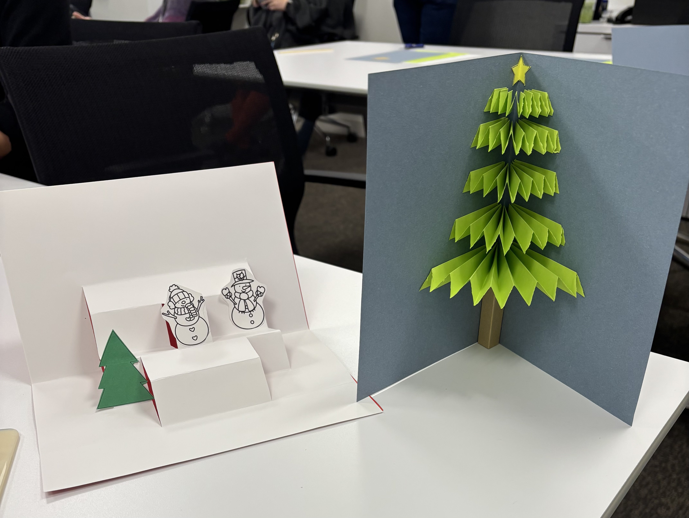

# Penn Workshop #

  

Last Tuesday (12/3), I had a chance to attend the “Making a Pop-Up Card” hosted by the Education Commons. In the celebration of the Winter holidays, I was able to learn how to create handmade pop-up cards using basic origami and cutting skills. Two pop-up cards included a Christmas tree and a 3D staircase. To make a 3D Christmas tree, the green paper was first folded evenly 16 times to create the shape of an “accordion”. Then, the green paper was cut into 5 pieces with all differing lengths and was ordered from the shortest to the tallest so that the tree had a pointed end on the top. Finally, the green paper was taped on both sides of the cards so that it would appear to “pop up” when someone opened the paper. Star and the tree trunk were added to the top and bottom of the tree to complete the card. The next part of the activity was creating a 3D staircase which was a much simpler task than building a Christmas tree. The paper was folded and cut in the middle of the page so that stairs would pop up towards the reader. On the stairs, paper-cut snowmen and trees were taped down to represent the sceneries of winter hills covered with snow. Later that day, I wrote a handwritten letter inside the card to give to my family members. Through this workshop, I learned valuable skills in handcrafting a letter and origami skills that I can use in the future. I can perhaps use the same skills learned through this workshop to create cards for different holidays (Thanksgiving, birthday).

At first, while attending the workshop, I thought the paper-folding skills that I learned in the workshop were very distant from the topics that we learned in the class. There was no data that was being digitized or stored in a tangible form. However, while writing this reflection, I realized that the pop-up cards that I made in the workshop can be “an archive” as described by Dorothy Berry in the article “The House Archives Built”. She describes that archives are “anything that collects/holds references to the past” (Berry, 2021) and has huge relationships with the memories. In other words, any objects that can store and spark memories can be an archive. After rereading the article, I realized how the pop-up card that I gifted to my parents has become an archive ever since I made it and will be able to spark memories when found 10 or 20 years later. The memories that the cards hold will be different between myself and my parents: the card would remind me of the digital humanities class while the card would remind them of the grateful feeling that they had. However, the cards have successfully stored the memories in the tangible form and have been made into the “permanent form”. I have simply “commodified the memories into a collection” (Berry, 2021) as termed by Dorothy Berry. The memories can be forgotten and I may not remember making these cards; yet, the existence of the cards will store the memories. In addition, if the pop-up cards are later treated as “the archive” but are lost, the memory still exists in ourselves, and “to value memory as fact requires a transformative mindset” (Berry, 2021), which would be crucial in turning my memories into words that can be recorded in the archive. 

In conclusion, the workshop gave me a memorable experience with making pop-up winter holiday cards for my family. The skills that I learned through this experience gave me ideas for future cards. Most importantly, the making of cards was able to store my memories into the archive which can be stored permanently.

Click on [homepage](https://youbin03.github.io/) to return to main page.
